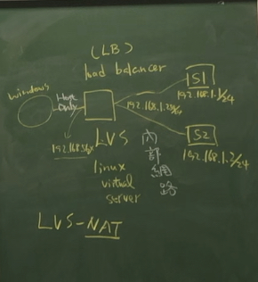

# 附載均衡器 LVS(Linux Virtual Server)-NAT模式

## 概念


## 準備機器
> 準備三台虛擬機(vm1、vm2、vm3)

機器|vm1|vm2|vm3
:-:|:-:|:-:|:-:
-|S1|S2|LVS
網路卡|NAT：下載軟體 <br> Host-Only、內部網路|內部網路|內部網路
Address|192.168.1.1|192.168.1.2|192.168.1.254
Netmask|24|24|24
Getway|192.168.1.254|192.168.1.254|-

1. 環境設定
* vm1
```sh
[root@vm1 user]# ip addr add 192.168.1.1/24 brd + dev enp0s9
[root@vm1 user]# ip route add default via 192.168.1.254
```
* vm2
```sh
[root@vm2 user]# ip addr add 192.168.1.2/24 brd + dev enp0s9
[root@vm2 user]# ip route add default via 192.168.1.254
```
* vm3
```sh
[root@vm3 user]# ip addr add 192.168.1.254/24 brd + dev enp0s9
``` 
> 要將 vm1、vm2 的 NAT 關閉，vm3 ping vm1、vm2 測試

## 範例一
1. 確認 vm1、vm2、vm3 的 httpd 是否啟動：`systemctl status httpd.service`
2. vm1、vm2 到 /var/www/html 新增 a.htm  
```sh
[root@vm1 html]# echo "centos7-1" > a.htm
[root@vm1 html]# cat a.htm
centos7-1

[root@vm2 html]# echo "centos7-2" > a.htm
[root@vm2 html]# cat a.htm
centos7-2
```

3. 測試
```sh
[root@vm3 ~]# curl http://192.168.1.1/a.htm
centos7-1
[root@vm3 ~]# curl http://192.168.1.2/a.htm
centos7-2
```

4. 到 vm3(LB) 上安裝套件，並將 ipvs 載入到核心中
```sh
[root@vm3 ~]# yum install ipvsadm -y
[root@vm3 ~]# modprobe ip_vs
```
* ipvsadm 指令
  - `ipvsadm -L`：`-L` list，規則
  - `ipvsadm -C`：刪除全部
  ```sh
  [root@vm3 ~]# ipvsadm -L
  IP Virtual Server version 1.2.1 (size=4096)
  Prot LocalAddress:Port Scheduler Flags
    -> RemoteAddress:Port           Forward Weight ActiveConn InActConn
  ```

5. 開啟路由功能(暫時)
```sh
[root@vm3 ~]# echo 1 > /proc/sys/net/ipv4/ip_forward
```
6. 開啟路由功能(永久)
* 編輯 `/etc/sysctl.conf` 文件，最後增加 `net.ipv4.ip_forward = 1`
> 配置檔配置模式
```sh
[root@vm3 ~]# vim /etc/sysctl.conf

[root@vm3 ~]# sysctl -p
net.ipv4.ip_forward = 1
```
7. 在 vm3(LB) 設定負載均衡
* `ipvsadm -A -t 192.168.56.103:80 -s rr`：產生虛擬 IP 對應 80port
  - `rr`：Round-Robin，輪叫調度
* `ipvsadm -a -t 192.168.56.103:80 -r 192.168.1.1:80 -m`
  - `-m`：用 NAT 模式
* ``
```sh
[root@vm3 ~]# ipvsadm -A -t 192.168.56.103:80 -s rr
[root@vm3 ~]# ipvsadm -a -t 192.168.56.103:80 -r 192.168.1.1:80 -m
[root@vm3 ~]# ipvsadm -a -t 192.168.56.103:80 -r 192.168.1.2:80 -m
```
8. 測試
```sh
[root@vm3 ~]# curl 192.168.56.103:80/a.htm
centos7-1
[root@vm3 ~]# curl 192.168.56.103:80/a.htm
centos7-2
```

---
參考：
- [LVS原理篇：LVS简介、结构、四种模式、十种算法](https://blog.csdn.net/lcl_xiaowugui/article/details/81701949)
