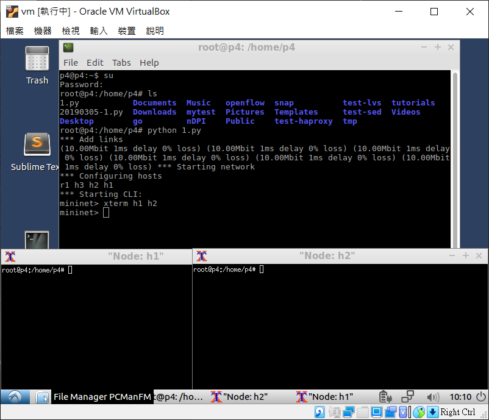
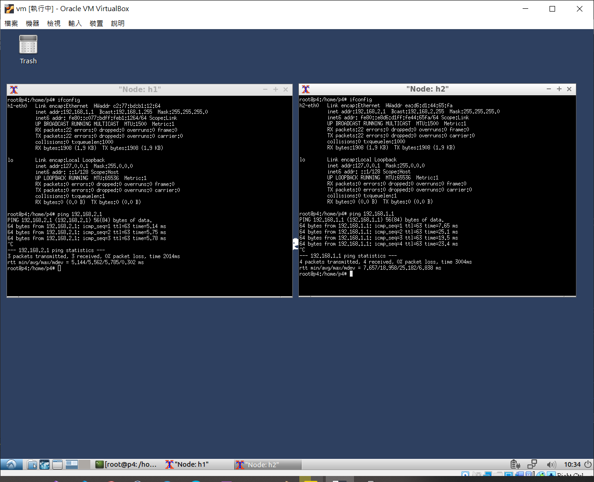
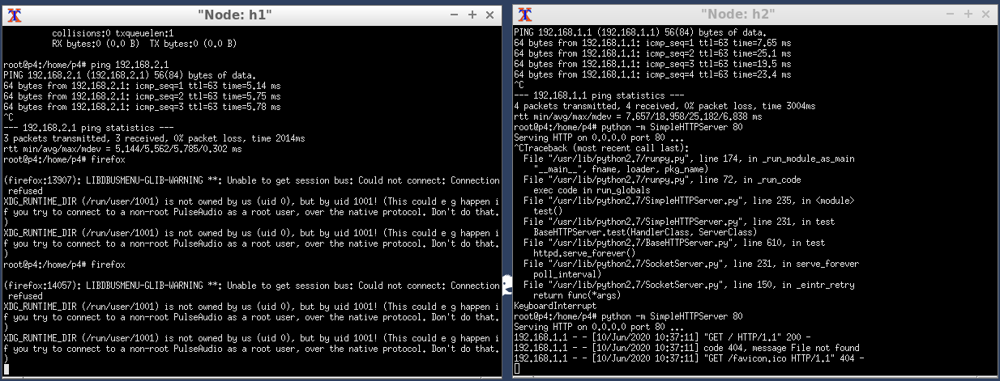
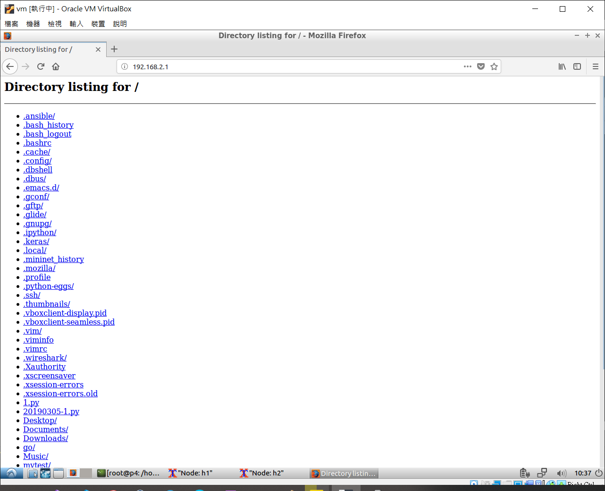

# mininet 網路模擬器
* 準備一個 ubuntu 環境
* 使用 python 創建 mininet
```py
#!/usr/bin/python

from mininet.net import Mininet
from mininet.node import Host
from mininet.cli import CLI
from mininet.link import TCLink, Intf
from mininet.log import setLogLevel, info
from subprocess import call

def myNetwork():
    net = Mininet(topo=None, build=False)

    r1 = net.addHost('r1')
    h3 = net.addHost('h3')
    h2 = net.addHost('h2')
    h1 = net.addHost('h1')

    info( '*** Add links\n')
    mylink = {'bw':10,'delay':'1ms','loss':0}  
             # bw 頻寬、delay 延遲、loss 遺失
    net.addLink(h1, r1, cls=TCLink , **mylink)
    net.addLink(h2, r1, cls=TCLink , **mylink)
    net.addLink(h3, r1, cls=TCLink , **mylink)

    info( '*** Starting network\n')
    net.build()

    # 清除網路卡 ip
    h1.cmd("ifconfig h1-eth0 0")
    h2.cmd("ifconfig h2-eth0 0")
    h3.cmd("ifconfig h3-eth0 0")
    r1.cmd("ifconfig r1-eth0 0")
    r1.cmd("ifconfig r1-eth1 0")
    r1.cmd("ifconfig r1-eth2 0")
    
    # 啟動路由器
    r1.cmd("echo 1 > /proc/sys/net/ipv4/ip_forward")
    r1.cmd("ip addr add 192.168.1.254/24 brd + dev r1-eth0")
    r1.cmd("ip addr add 192.168.2.254/24 brd + dev r1-eth1")
    r1.cmd("ip addr add 192.168.3.254/24 brd + dev r1-eth2")  

    h1.cmd("ip addr add 192.168.1.1/24 brd + dev h1-eth0")
    h1.cmd("ip route add default via 192.168.1.254")
    h2.cmd("ip addr add 192.168.2.1/24 brd + dev h2-eth0")
    h2.cmd("ip route add default via 192.168.2.254")
    h3.cmd("ip addr add 192.168.3.1/24 brd + dev h3-eth0")
    h3.cmd("ip route add default via 192.168.3.254")

    
    CLI(net)
    net.stop()

if __name__ == '__main__':
    setLogLevel( 'info' )
    myNetwork()
```
2. 執行 `python 1.py`
3. 開啟結點的終端機
```sh
mininet> xterm h1 h2
```
* 執行結果



## 範例一 - 在 h1、h2 終端機執行互 ping
* h1：192.168.1.1 
* h2：192.168.2.1



## 範例二
1. h2 執行 `python -m SimpleHTTPServer 80` \
h1 執行 `firefox`



2. 網頁輸入 h2 的 ip



# LVS
```py
from mininet.net import Containernet    # mininet 的加強版，有支援 Docker
from mininet.cli import CLI
from mininet.link import Link,TCLink,Intf
from mininet.log import setLogLevel
from mininet.node import Docker
from time import sleep

if '__main__' == __name__:
    setLogLevel('info')
    net = Containernet(link=TCLink)
    h1 = net.addHost('h1',ip="10.0.1.1/24")
    r = net.addHost('r')    # 產生一台路由器

    # Docker
    h2 = net.addDocker('h2', mac = '00:00:00:00:02:02', ip="10.0.2.2/24", dimage="smallko/php-apache-dev:v10",cpu_period=50000, cpu_quota=1000)
    h3 = net.addDocker('h3', mac = '00:00:00:00:03:03', ip="10.0.3.3/24", dimage="smallko/php-apache-dev:v10",cpu_period=50000, cpu_quota=1000)
    h4 = net.addDocker('h4', mac = '00:00:00:00:04:04', ip="10.0.4.4/24", dimage="smallko/php-apache-dev:v10",cpu_period=50000, cpu_quota=1000)
    net.addLink(h1, r, cls=TCLink, bw=10)
    net.addLink(h2, r, cls=TCLink, bw=10)
    net.addLink(h3, r, cls=TCLink, bw=10)
    net.addLink(h4, r, cls=TCLink, bw=10)
    net.start()
    h1,h2,h3,h4,r=net.get('h1','h2','h3','h4','r')
    r.cmd("ifconfig r-eth0 0")
    r.cmd("ifconfig r-eth1 0")
    r.cmd("ifconfig r-eth2 0")
    r.cmd("ifconfig r-eth3 0")
    r.cmd("echo 1 > /proc/sys/net/ipv4/ip_forward")
    r.cmd("ip addr add 10.0.1.254/24 brd + dev r-eth0")
    r.cmd("ip addr add 10.0.2.254/24 brd + dev r-eth1")
    r.cmd("ip addr add 10.0.3.254/24 brd + dev r-eth2")
    r.cmd("ip addr add 10.0.4.254/24 brd + dev r-eth3")
    r.cmd("iptables -t nat -A POSTROUTING -s 10.0.2.0/24 -o r-eth0  -j MASQUERADE")
    r.cmd("iptables -t nat -A POSTROUTING -s 10.0.3.0/24 -o r-eth0  -j MASQUERADE")
    r.cmd("iptables -t nat -A POSTROUTING -s 10.0.4.0/24 -o r-eth0  -j MASQUERADE")
    r.cmd("ipvsadm -A -t 10.0.1.254:80 -s rr")
    r.cmd("ipvsadm -a -t 10.0.1.254:80 -r 10.0.2.2:80 -m")
    r.cmd("ipvsadm -a -t 10.0.1.254:80 -r 10.0.3.3:80 -m")
    r.cmd("ipvsadm -a -t 10.0.1.254:80 -r 10.0.4.4:80 -m")
    h1.cmd("ip route add default via 10.0.1.254")
    h2.cmd("ip route del default")
    h2.cmd("ip route add default via 10.0.2.254")
    h2.cmd("cd /var/www/html; echo h2 > a.htm ; python -m SimpleHTTPServer 80 &")
    h3.cmd("ip route del default")
    h3.cmd("ip route add default via 10.0.3.254")
    h3.cmd("cd /var/www/html; echo h3 > a.htm ; python -m SimpleHTTPServer 80 &")
    h4.cmd("ip route del default")
    h4.cmd("ip route add default via 10.0.4.254")
    h4.cmd("cd /var/www/html; echo h4 > a.htm ; python -m SimpleHTTPServer 80 &")
    CLI(net)
    net.stop()
```
## 測試一：
```sh
root@p4:/home/p4# docker ps
CONTAINER ID        IMAGE                        COMMAND                  CREATE   D             STATUS              PORTS                                                                       NAMES
e7bcfff73e77        smallko/php-apache-dev:v10   "/entrypoint /bin/bas"   24 min   utes ago      Up 24 minutes       0.0.0.0:32776->80/tcp, 0.0.0.0:32775->443/tcp,    0.0.0.0:32774->9000/tcp   mn.h4
bee2f7520b90        smallko/php-apache-dev:v10   "/entrypoint /bin/bas"   24 min   utes ago      Up 24 minutes       0.0.0.0:32773->80/tcp, 0.0.0.0:32772->443/tcp,    0.0.0.0:32771->9000/tcp   mn.h3
9fce17432b1f        smallko/php-apache-dev:v10   "/entrypoint /bin/bas"   24 min   utes ago      Up 24 minutes       0.0.0.0:32770->80/tcp, 0.0.0.0:32769->443/tcp,    0.0.0.0:32768->9000/tcp   mn.h2
root@p4:/home/p4# docker exec -it mn.h2 bash
root@h2:/# ip route show
default via 10.0.2.254 dev h2-eth0
10.0.2.0/24 dev h2-eth0 proto kernel scope link src 10.0.2.2
172.17.0.0/16 dev eth0 proto kernel scope link src 172.17.0.2
root@h2:/# cd /var/www/html
root@h2:/var/www/html# ls
a.htm  a.jpg  b.jpg  hi.htm  hi.php  index.html  index.php
root@h2:/var/www/html# cat a.htm
h2

```
* 執行結果
```sh
mininet> h1 curl http://10.0.1.254/a.htm
h4
mininet> h1 curl http://10.0.1.254/a.htm
h3
mininet> h1 curl http://10.0.1.254/a.htm
h2
mininet> h1 curl http://10.0.1.254/a.htm
h4
mininet> r ipvsadm -Ln
IP Virtual Server version 1.2.1 (size=4096)
Prot LocalAddress:Port Scheduler Flags
  -> RemoteAddress:Port           Forward Weight ActiveConn InActConn
TCP  10.0.1.254:80 rr
  -> 10.0.2.2:80                  Masq    1      0          0
  -> 10.0.3.3:80                  Masq    1      0          0
  -> 10.0.4.4:80                  Masq    1      0          0
```
## 測試二：
```sh
mininet> h1 ab -n 1000 -c 10 10.0.1.254/a.htm
# ab 是 HTTP 用來測試的模擬軟體，用來模擬 10 人做 1000 次連線
```
* 執行結果
```sh
mininet> h1 ab -n 1000 -c 10 10.0.1.254/a.htm
This is ApacheBench, Version 2.3 <$Revision: 1706008 $>
Copyright 1996 Adam Twiss, Zeus Technology Ltd, http://www.zeustech.net/
Licensed to The Apache Software Foundation, http://www.apache.org/

Benchmarking 10.0.1.254 (be patient)
Completed 100 requests
Completed 200 requests
Completed 300 requests
Completed 400 requests
Completed 500 requests
Completed 600 requests
Completed 700 requests
Completed 800 requests
Completed 900 requests
Completed 1000 requests
Finished 1000 requests


Server Software:        SimpleHTTP/0.6
Server Hostname:        10.0.1.254
Server Port:            80

Document Path:          /a.htm
Document Length:        3 bytes

Concurrency Level:      10
Time taken for tests:   17.185 seconds
Complete requests:      1000
Failed requests:        0
Total transferred:      190000 bytes
HTML transferred:       3000 bytes
Requests per second:    58.19 [#/sec] (mean)
Time per request:       171.849 [ms] (mean)
Time per request:       17.185 [ms] (mean, across all concurrent requests)
Transfer rate:          10.80 [Kbytes/sec] received

Connection Times (ms)
              min  mean[+/-sd] median   max
Connect:        0    2  44.7      0    1004
Processing:     1  169 147.0    148    1650
Waiting:        0  149 144.3    103    1649
Total:          1  171 156.3    149    1650

Percentage of the requests served within a certain time (ms)
  50%    149
  66%    198
  75%    242
  80%    251
  90%    333
  95%    403
  98%    549
  99%    653
 100%   1650 (longest request)
```

---
參考：
- [柯志亨 老師的網站](http://csie.nqu.edu.tw/smallko/sdn/lvs_haproxy.htm)
- [LVS 和 Keepalived 的原理介绍和配置实践](https://wsgzao.github.io/post/lvs-keepalived/)
- [LVS-DR 原理介绍和配置实践](https://wsgzao.github.io/post/lvs-dr/)