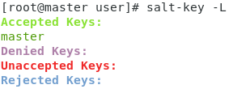
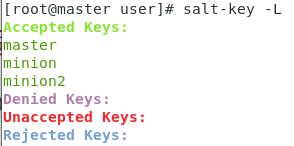
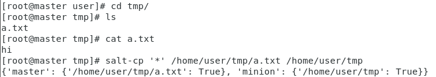
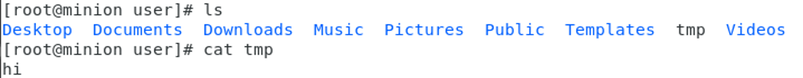
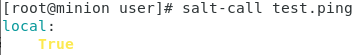
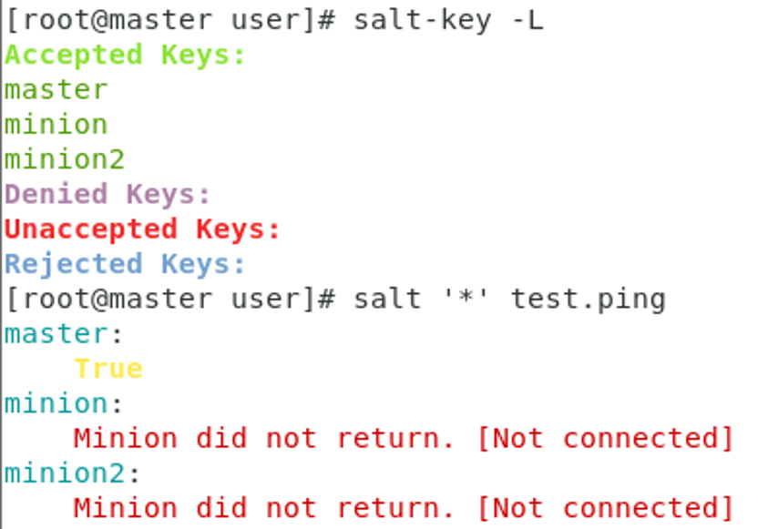

# 期末報告

## 主題：SaltStack
## 什麼是 SaltStack?
* SaltStack 是一個服務器基礎架構集中化管理平台，具備配置管理、遠程執行、監控等功能，可以在成千上萬台服務器上做到批量執行命令。

## SaltStack 優點
1. 部署簡單、方便
2. 支持大部分 UNIX/Linux及Windows環境
3. 主從集中化管理
4. 配置簡單、功能強大、擴展性強
5. 主控端(Master)與被主控端(Minion)基於憑證認證
6. 支援API以及自定義模組，透過Python擴展

### SaltStack Master(Server)
* 中央管理系統(服務端)，這個系統是用來發送命令和配置到SlatStack Minion上運行
### SaltStack Minion(Client)
* 被管理系統(客戶端)，該系統接受來自SaltStack Master的命令和配置

## 如何在 CentOS 下安裝 SaltStack
> 由於SaltStack架構分為Server(Master)和Client(Minion)，故需要至少兩台虛擬機來執行，一台當作Server(Master)另一台當作Client(Minion)
* Master(Server)
    - 需要安裝「Master」和「Minion」工具
    - 關閉防火牆或開啟防火牆「TCP 4505、 4506」例外規則
        - 4505 port：對應Publisher，Master通過此port用來發送消息給所有Minion，使命令可以在大量系統上同時執行
        - 4506 port：對應Request Server，是Minion將結果發送到Master來接受消息的
* Minion(Client)
    - 需要安裝「Minion」工具

### 1. 準備三台 CentOS 虛擬機
> 以下指令由超級使用者(root)執行

-|Hostname|Network|IP|Status
-|-|-|-|-
server|master|NAT、Host-Only|192.168.56.104|open
client|minion|NAT、Host-Only|192.168.56.105|open
client|minion2|NAT、Host-Only|192.168.56.106|turn off

    a. 關閉「SELINUX」並重新開機
        # gedit /etc/sysconfig/selinux
             SELINUX=disable
        # reboot

    b. 安裝「epel-release」，為了擴充資料庫
        # yum install –y epel-release

### 2. Master(Server)
> 以下指令由超級使用者(root)執行
1. 關閉防火牆或開啟防火牆「TCP 4505、 4506」例外規則
* `systemctl disable firewalld` or \
`firewall-cmd --add-port=4505/tcp --permanent`\
`firewall-cmd --add-port=4506/tcp --permanent`
2. 檢查「4505」、「4506」端口
* `netstat –tunlp | grep –e 4505 –e 4506`
3. 安裝「salt-master」和「salt-minion」
* `yum –y install salt-master salt-minion`
4. 配置「Salt-Master」主機「IP」
* `gedit /etc/salt/master`
> Interface: 192.168.56.104\
auto_accept:True  	# 自動接受「minion」請求
5. 啟動即設定開機自動啟動「Salt-Master」
* `systemctl start salt-master.service`
* `systemctl enable salt-master.service`
6. 配置「Salt-Minion」指向「Server」主機「IP」
* `gedit /etc/salt/minion`
> master:192.168.56.104 	# server ip
7. 啟動即設定開機自動啟動「Salt-Minion」
* `systemctl start salt-minion.service`
* `systemctl enable salt-minion.service`
8. 檢查「Master」是否監控
* `salt-key –L`
    > 在Accepted Keys下方才算有監控到

    

### 2. Minion(Client)
> 以下指令由超級使用者(root)執行
1. 安裝「salt-minion」
* `yum –y install salt-minion`
2. 指向「Salt-Master」主機「IP」
* `gedit /etc/salt/minion`
> master:192.168.56.104 	# server ip
3. 啟動及設定開機自動啟動「Salt- Minion」
* `systemctl start salt-minion.service`
* `systemctl enable salt-minion.service`
4. Minion 在 /etc/hosts 加入 Master 的 ip ，名字叫 salt
> 因為 Minion 預設是去找 salt 這個 name 的 Server
* `gedit /etc/hosts`
> 192.168.56.104 salt
5. 到 Master 端查看是否有連上
* `salt-key –L`
    > 在Accepted Keys下看到master、minion、minion2 三台

    

## SaltStack 指令
> 指令有分只能在Server端執行和能在Server端和Client端執行
### 只能在Master下執行的指令
1. `salt-key [option] [target]`：salt-key -a minion
* `-A`：添加全部 minion-key
* `-a`：接受指定 minion-key
* `-R`：拒絕全部 minion-key
* `-D`：刪除全部 minion-key
* `-d`：刪除指定 minion-key
* `-L`：查看所有 minion-key
2. `salt 'target' cmd.run '指令'`：salt 'minion' cmd.run 'ifconfig'
3. `salt 'target' test.ping`：測試認證 minion
* `salt '*' test.ping`：測試認證全部 minion
    * `'*'`：全部
4. `salt-run [option] [runner.func]`：
* `salt-run manage.status`：查看所有 minion 狀態
* `salt-run manage.down`：查看所有沒在線的 minion
* `salt-run manage.up`：查看所有在線的 minion
5. `salt-cp`：copy 複製
* `salt-cp ‘*’ /home/user/tmp/a.txt  /tmp`：將 Master /home/user/tmp/a.txt 複製到 Minion 下的 /tmp
    - [Master]
    
    - [Minion]
    
### Minion
> Minion下指令給自己執行，不需要通過Master發布指令
1. `salt-call test.ping`：查看 minion 狀態

## SaltStack 實作
* 狀況：第一台的minion是開啟的，但在master卻無法認證到

> 原因：minion端的key與master端不符，先刪除minion端的key，在重新與master進行連接與認證
* 解決辦法：
    1. STEP1：在[Master]刪除指定 minion
	    * `salt-key –d minion`
    2. STEP2：在[Minion]刪除 /etc/salt/pki/minion/ 下的資料 
        * `rm –rf /etc/salt/pki/minion/`
    3. STEP3：在[Minion]重啟
        * `systemctl restart salt-minion.service`
    4. STEP3：在[Master]再次確認
        * `salt-key -L`
    

---
參考：
- [SaltStack 介紹](https://k2r2bai.com/2016/02/12/devops/cm/saltstack-basic/)
- [S小魚仔S Centos 7 SaltStack 自動化運維工具](https://my-fish-it.blogspot.com/2017/08/ss-centos-7-saltstack.html)
- [what is saltstack系列零：理解SaltStack运行原理](https://blog.csdn.net/watermelonbig/article/details/80758635?utm_medium=distribute.pc_relevant.none-task-blog-BlogCommendFromMachineLearnPai2-1.nonecase&depth_1-utm_source=distribute.pc_relevant.none-task-blog-BlogCommendFromMachineLearnPai2-1.nonecase)
- [安裝slatstack-第一種架構](https://snoopy30485.github.io/2018/11/30/%E5%AE%89%E8%A3%9Dslatstack-%E7%AC%AC%E4%B8%80%E7%A8%AE%E6%9E%B6%E6%A7%8B/)
- [SaltStack学习](https://www.jianshu.com/p/624b9cf51c64)
- [saltstack 报错 Minion did not return. [No response]](https://blog.51cto.com/fengyunshan911/2064650)
- [自動化運維saltstack](https://kknews.cc/zh-tw/code/aly5m9g.html)
